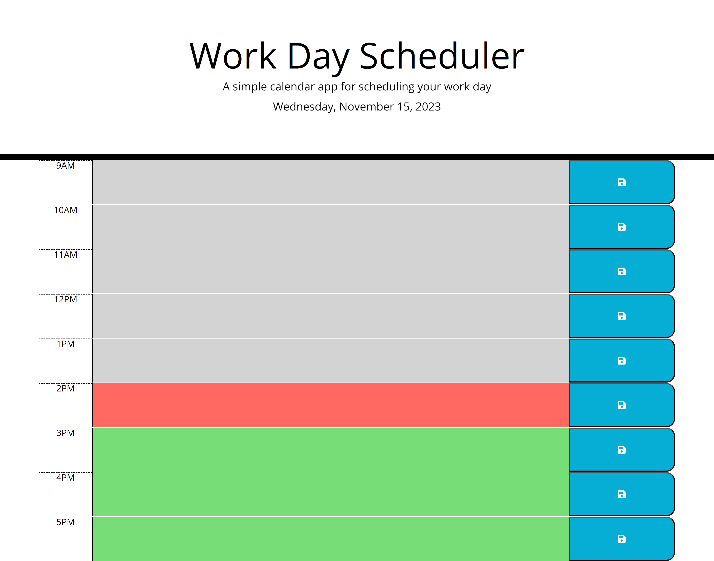

# Work Day Planner

## Table of Contents

- [Description](#description)
- [Instructions](#instructions)
- [Usage](#usage)
- [Screenshots](#work-day-planner-webpage)
- [Demo](#demo)
- [Credits](#credits)
- [License](#license)
- [Badges](#badges)
- [Conclusion](#conclusion)

## Description

This project is a simple calendar application that empowers users to save events for each hour of the day. Leveraging third-party APIs, specifically Day.js for date and time manipulation, the application features dynamically updated HTML and CSS powered by jQuery. It's designed to cater to employees with busy schedules, helping them manage their time effectively.

## Instructions

1. Clone the repository to your local machine.

   ```bash
   git clone https://github.com/ClaireFraser121/work-day-planner

1. **Open the `index.html` file in your browser to launch the planner.**

2. **The current day is displayed at the top of the calendar when you open the planner.**

3. **Scroll down to view timeblocks for standard business hours.**

4. **Each timeblock is color-coded based on whether it's in the past, present, or future.**

5. **Click on a timeblock to enter an event.**

6. **Click the save button in the timeblock to save the event to local storage.**

7. **Your events persist between refreshes of the page.**

## Usage

This daily planner is useful for anyone looking to organize their workday effectively. It's particularly handy for employees with a busy schedule who want to add and manage important events throughout the day.

# Work Day Planner Webpage

The screenshot showcases the Work Day Planner, a sleek and intuitive web application designed for effective daily schedule management. The top of the page prominently displays the current day, providing users with immediate date reference.

As you scroll down, timeblocks for standard business hours unfold, each intelligently color-coded to denote whether it's in the past, present, or future. This visual cue aids users in quickly identifying their current point in the day.

The application enables users to effortlessly enter events by simply clicking on the relevant timeblock. A clean and user-friendly text area appears, ready for input. The save button, neatly positioned alongside the timeblock, allows users to store their events seamlessly.

Moreover, the Work Day Planner ensures that events persist between page refreshes, enhancing the user experience and preventing data loss. Its responsive design and compatibility with Day.js contribute to a smooth and efficient planning process.

In summary, the Work Day Planner provides an elegant solution for professionals seeking a robust tool to manage their daily tasks with precision and ease.



## Demo

View the live demo of the [Work Day Planner](<https://clairefraser121.github.io/work-day-planner/>).

## Credits

- jQuery Tutorial for Beginners #8 - jQuery Chaining
  - Source: [Net Ninja]( https://www.youtube.com/watch?v=u_srpc8P4H8)

- Format
  - Source: [Day.js]( https://day.js.org/docs/en/display/format)

- The setInterval() Function
  - Source: [UDACITY]( https://www.udacity.com/blog/2021/04/javascript-timers-wait-functions.html)

- Create textarea — Javascript
  - Source: [Muthu kumar Sathiyanesan]( https://medium.com/@muthurishi84/to-create-a-textarea-element-in-javascript-you-can-use-the-document-createelement-method-2f7a089ebbfc)

- LocalStorage, sessionStorage
  - Source: [JAVASCRIPT.INFO]( https://javascript.info/localstorage)

- How to create a button in JavaScript dynamically
  - Source: [3schools]( https://www.3schools.in/2021/11/how-to-create-button-in-javascript.html)

- localStorage in JavaScript: A complete guide
  - Source: [Nosa Obaseki]( https://blog.logrocket.com/localstorage-javascript-complete-guide/#:~:text=removeItem()%20%3A%20Remove%20an%20item,Clear%20all%20data%20from%20localStorage)

## License

This project is licensed under the MIT License.

## Badges

[](https://opensource.org/licenses/MIT)

## Conclusion

The Work Day Planner is a powerful tool for time management, providing a user-friendly interface to schedule and organize daily tasks. Its intuitive design and seamless integration with Day.js make it an essential companion for professionals striving for productivity. Feel free to contribute to the project and enhance its features to meet your unique needs. Happy planning!
